## ChatOps? 😕!

In a nutshell, the idea behind ChatOps is that the people who are most knowledgeable about the infrastructure are also the ones who can fix problems with it, so it makes sense to put both on the same communication platform. This means that if you have an outage, instead of sending an email or making a phone call, you can chat with someone on Slack and get things fixed more rapidly.

Regarding monitoring AWS resources, security notifications, CloudWatch & billing alerts, and a lot more, AWS Chatbot is a ChatOps solution from Amazon Web Services.

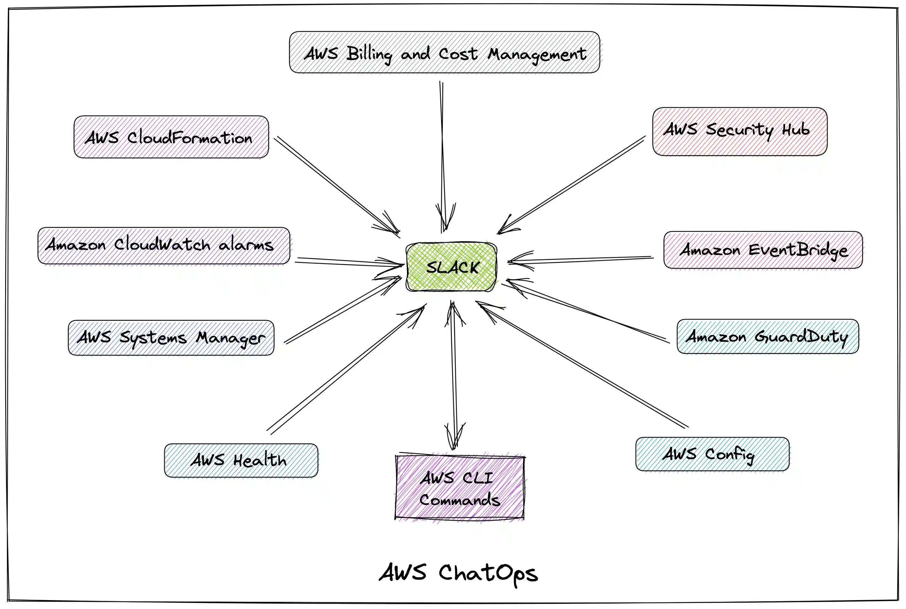

## Getting started with AWS Chatbot:

To begin with Chatbot, we will set up two practical use cases.

1. Getting AWS billing notifications on Slack.
2. Receiving EventBridge alerts on Slack.

### Prerequisites

- AWS Account
- Slack workspace
- AWS CLI configured/ AWS CloudShell

### Configuring Chatbot with Slack

- Head over to [Chatbot console](https://console.aws.amazon.com/Chatbot/).
- Under `Configure a chat client`, choose Slack, then select Configure client.

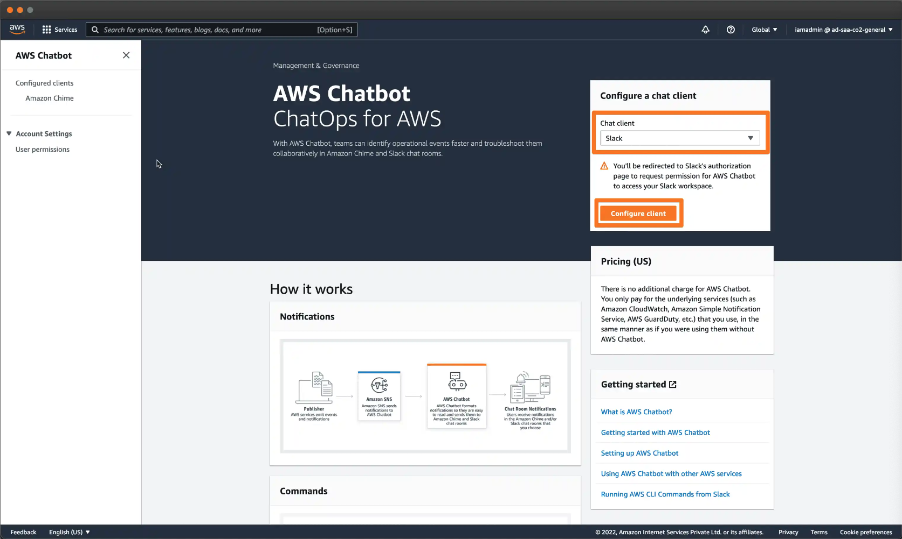

- You will be redirected to your Slack workspace for granting Chatbot permission for your Slack workspace.

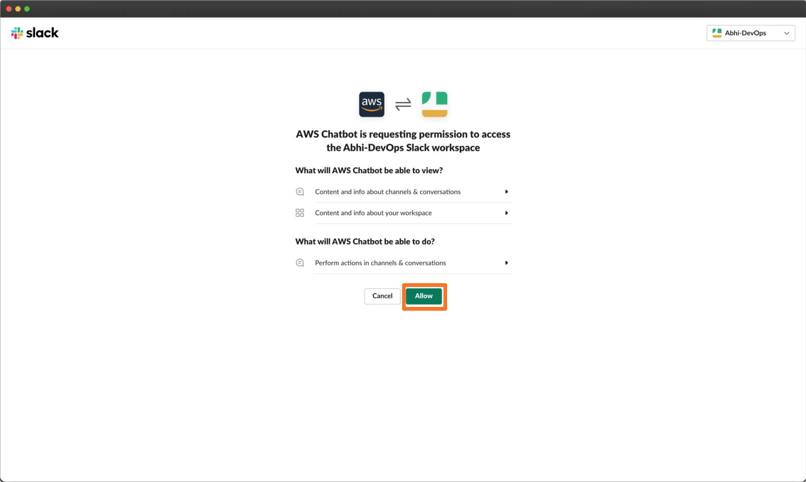

- After allowing, you will get a successful authorization message.

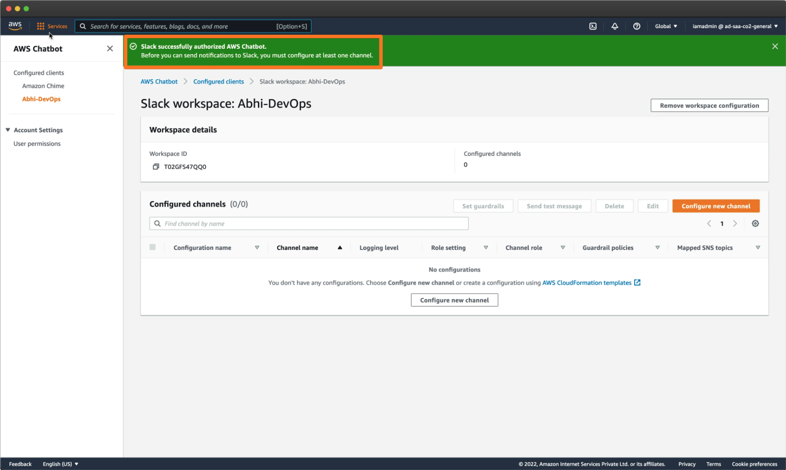

- We must configure at least one Slack channel before using Chatbot.


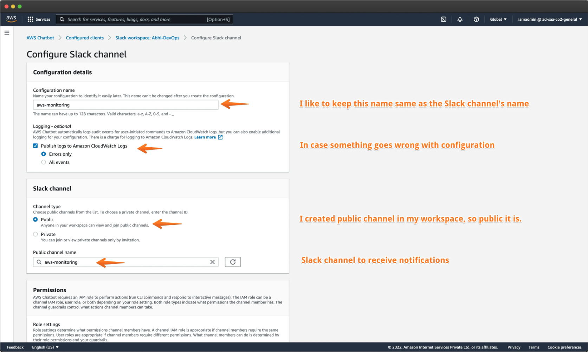

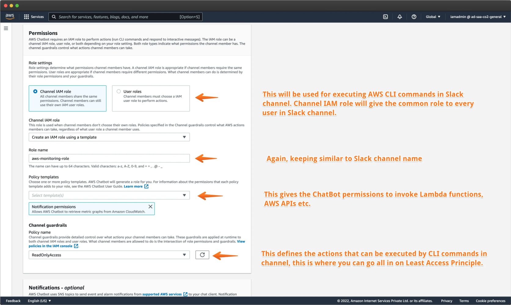

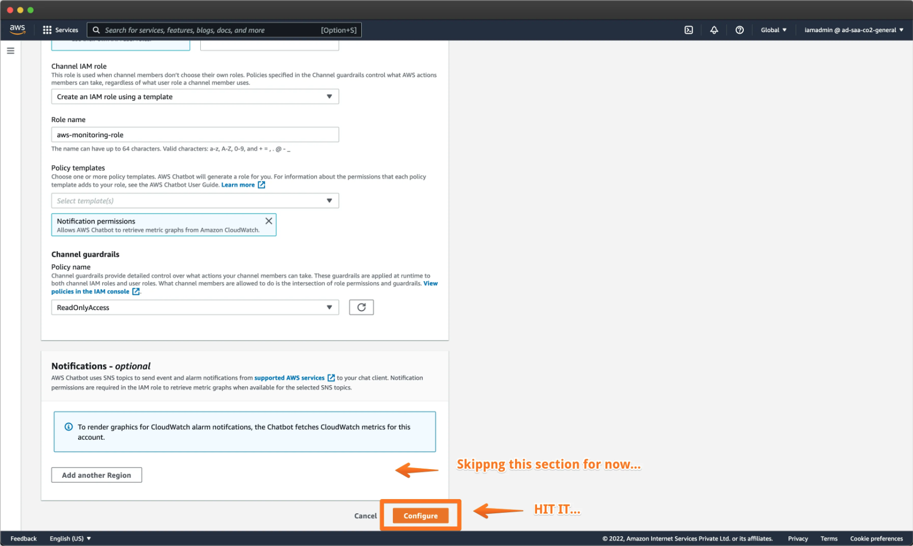

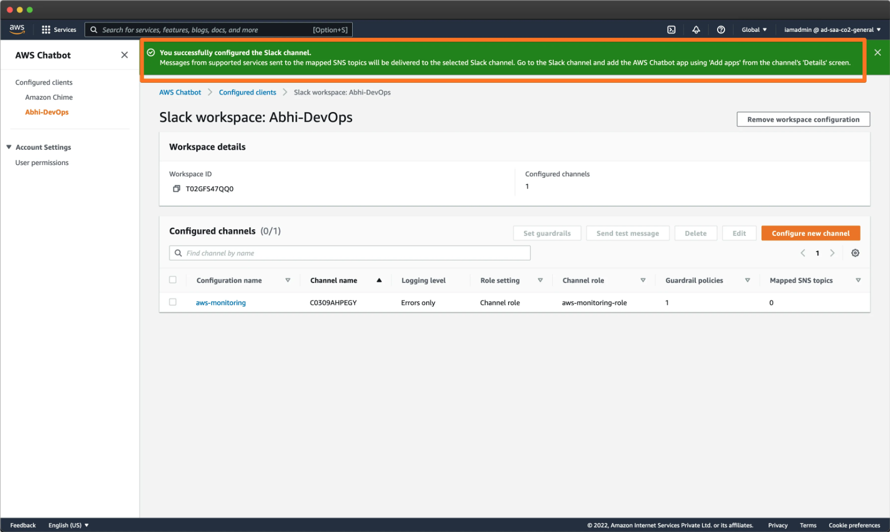

- Now, your Chatbot is connected to the Slack channel and can send messages to Slack.
- To test, let's create an SNS topic and subscribe using just configured Chatbot.
- I will be using [AWS CloudShell](https://aws.amazon.com/cloudshell/) to create AWS resources. You can use [AWS CLI](https://docs.aws.amazon.com/cli/latest/userguide/getting-started-install.html) on your local machine as well.
- Create SNS Topic with a policy attached (allowing AWS Events service to publish messages to this Topic).

```bash
# Get active account number
ACCOUNT_NUMBER=$(aws sts get-caller-identity --query Account --output text)

# Topic name
TOPIC_NAME="aws-monitoring"

# Create SNS topic
TOPIC_ARN=$(aws sns create-topic --name $TOPIC_NAME --query "TopicArn" --output text)

# Attach policy
aws sns set-topic-attributes \
--topic-arn $TOPIC_ARN \
--attribute-name Policy \
--attribute-value "{\"Version\":\"2008-10-17\",\"Id\":\"__default_policy_ID\",\"Statement\":[{\"Sid\":\"__default_statement_ID\",\"Effect\":\"Allow\",\"Principal\":{\"AWS\":\"*\"},\"Action\":[\"SNS:GetTopicAttributes\",\"SNS:SetTopicAttributes\",\"SNS:AddPermission\",\"SNS:RemovePermission\",\"SNS:DeleteTopic\",\"SNS:Subscribe\",\"SNS:ListSubscriptionsByTopic\",\"SNS:Publish\"],\"Resource\":\"$TOPIC_ARN\",\"Condition\":{\"StringEquals\":{\"AWS:SourceOwner\":\"$ACCOUNT_NUMBER\"}}},{\"Sid\":\"AWSEvents_Publish\",\"Effect\":\"Allow\",\"Principal\":{\"Service\":\"events.amazonaws.com\"},\"Action\":\"sns:Publish\",\"Resource\":\"$TOPIC_ARN\"}]}"
```
- Verify the Topic created in the console.

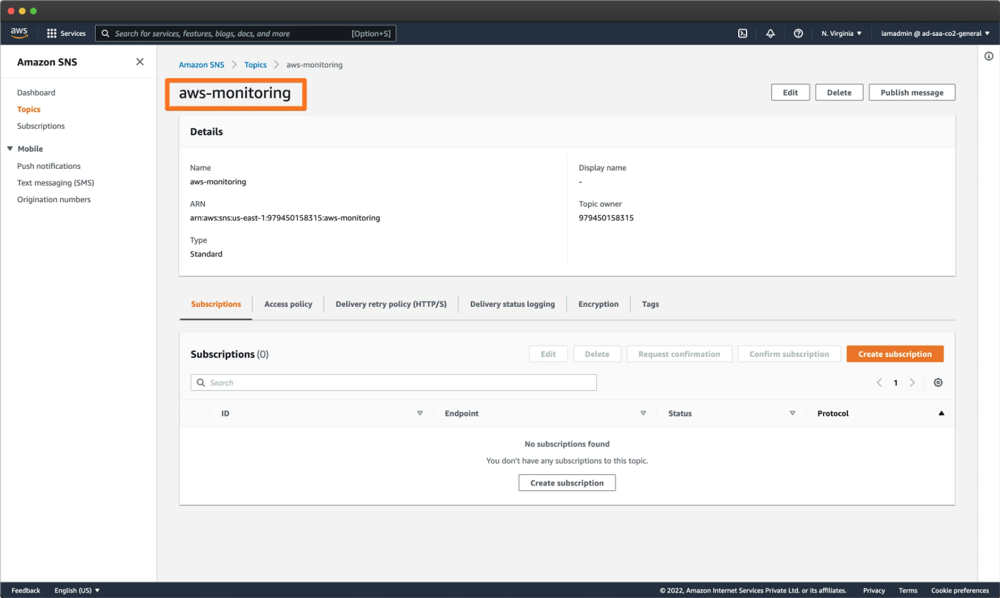

- Now, let's configure the Chatbot channel to use this Topic.
- Head over to Chatbot console, Select the channel and click on `Edit.`

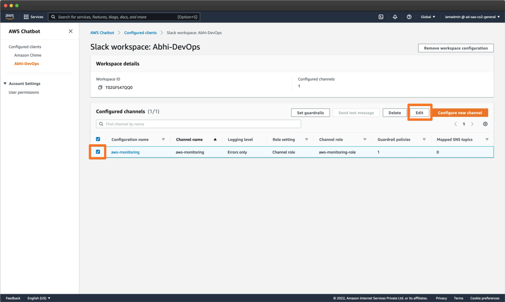

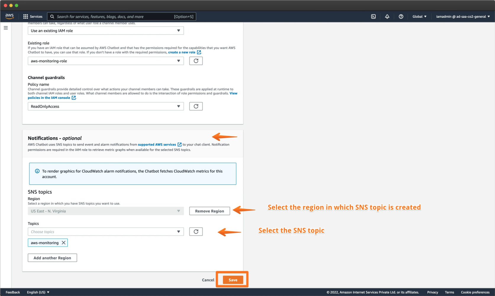

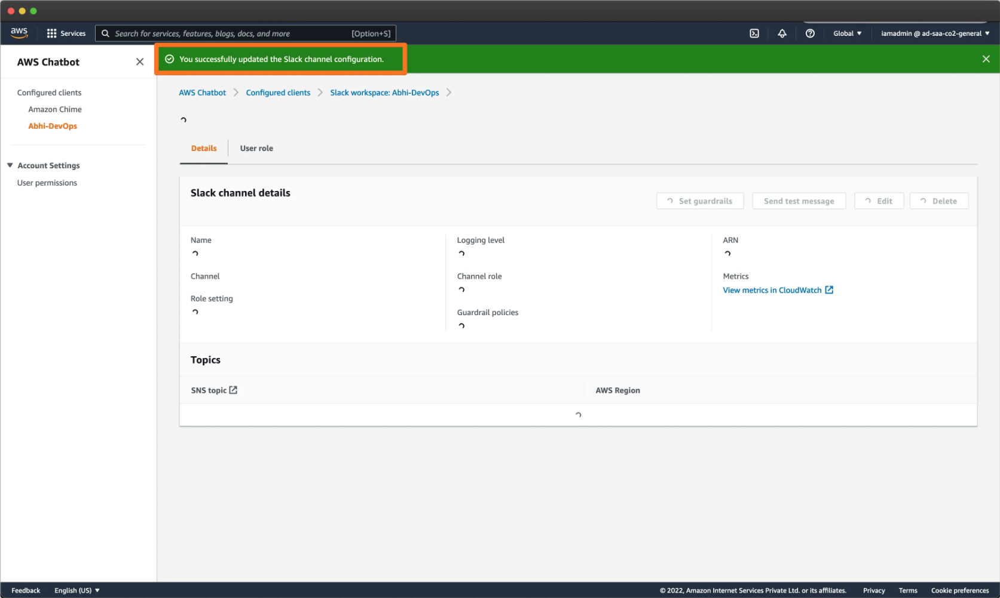

- Also, we can see the Chatbot subscription is added to the SNS topic.

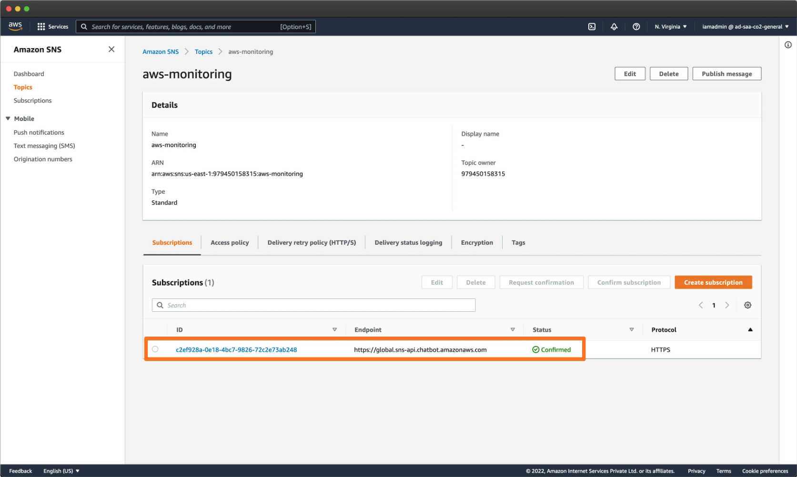

- We can test the connection between Chatbot and the Slack channel by sending a test message.

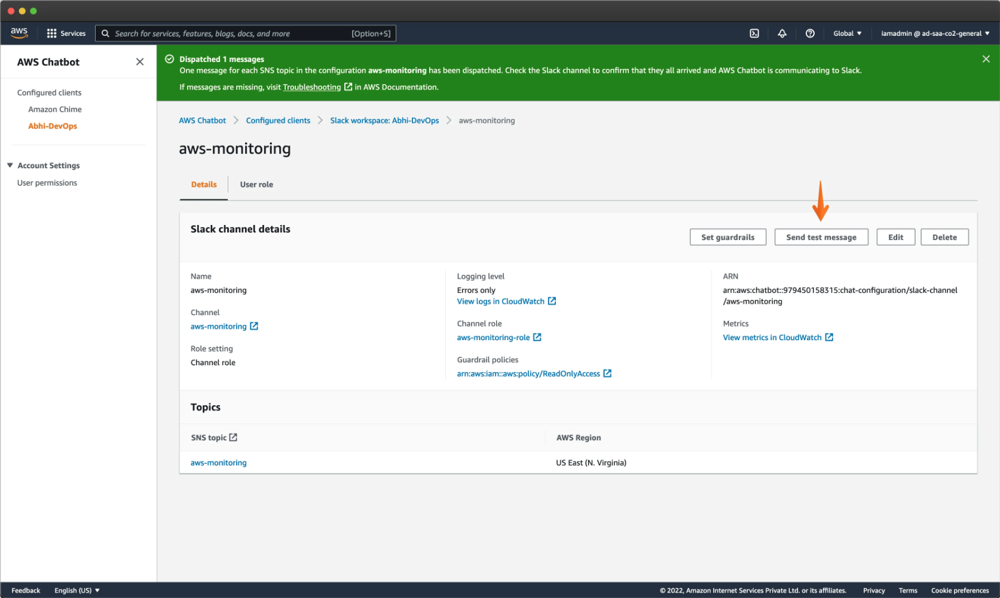

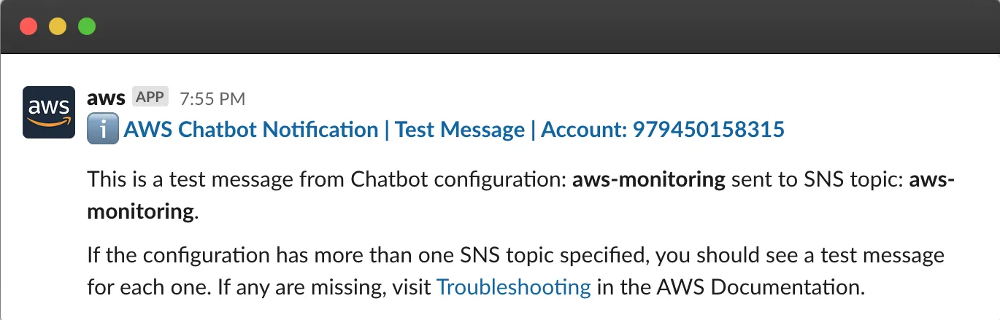

- 👍! Chatbot can send notifications to Slack.

## Getting AWS billing notifications on Slack

Let's create AWS billing notifications using the CloudWatch alarms.

### Prerequisites

- AWS Billing alerts enabled
    - To enable billing alerts, open console [here](https://console.aws.amazon.com/billing/home?#/preferences).
    - Select `Receive Billing Alerts` and save preference.

### Creating CloudWatch rule

- This CloudWatch rule will be triggered when your total bill cost crosses the threshold of `AMOUNT`.
- Also, this rule will push a message in the SNS topic created earlier.
- To enable the SNS topic for this rule, you will need the `ARN` of the SNS topic.

```bash
AMOUNT=0.1
SNS_ARN="arn:aws:sns:us-east-1:979450158315:aws-monitoring"

aws cloudwatch put-metric-alarm \
--alarm-name 'aws-billing-alerts' \
--actions-enabled \
--alarm-actions $SNS_ARN \
--metric-name 'EstimatedCharges' \
--namespace 'AWS/Billing' \
--statistic 'Maximum' \
--dimensions '[{"Name":"Currency","Value":"USD"}]' \
--period 21600 \
--evaluation-periods 1 \
--datapoints-to-alarm 1 \
--threshold $AMOUNT \
--comparison-operator 'GreaterThanThreshold' \
--treat-missing-data 'missing'
```

### Slack Notification

- Once the alarm goes into a triggered state, the notification will be sent to the SNS topic.
- Chatbot is added as a subscriber to the SNS topic, Chatbot will send the notification on the Slack channel.

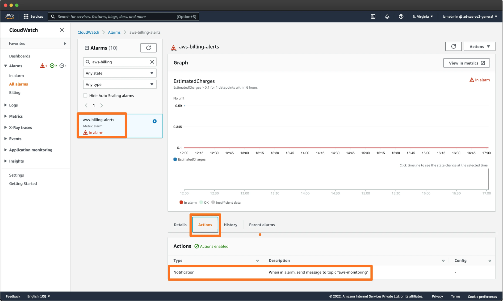

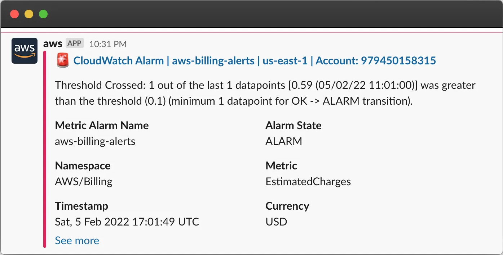

- I have set the `AMOUNT` to `USD0.1` to trigger the alert ASAP. You can adjust it based on your preferences.
- You can also create multiple billing alarms for varying amount thresholds.

## Receiving EventBridge alerts on Slack

Amazon EventBridge is a service for processing state changes from AWS resources. It provides a way to create, process, and manage events from AWS resources.

One of the essential features of EventBridge is that it processes events in real-time. This means that any changes made to your resources will be processed immediately, and EventBridge will notify you about them.

### Creating a EventBridge rule

- Let's create a simple rule triggered whenever an EC2 instance is started (goes to `Running` state) or is terminated.
- We will utilize the same SNS topic as a target for this rule.

```bash
SNS_ARN="arn:aws:sns:us-east-1:979450158315:aws-monitoring"
RULE_NAME="EC2InstanceStateChangeStartOrTerminate"

aws events put-rule \
--name $RULE_NAME \
--event-pattern "{\"source\":[\"aws.ec2\"],\"detail-type\":[\"EC2 Instance State-change Notification\"],\"detail\":{\"state\":[\"running\",\"terminated\"]}}"

aws events put-targets \
--rule $RULE_NAME \
--targets "Id"="1","Arn"=$SNS_ARN
```

- Now, you should see an EventBridge rule created, and a rule target should be the SNS topic.

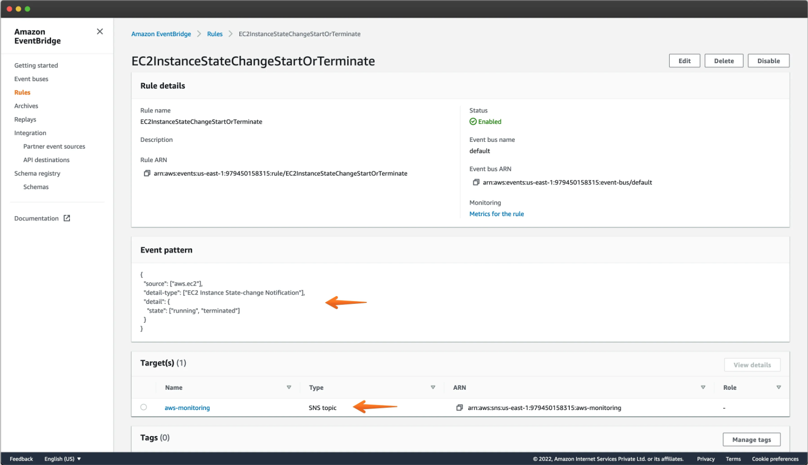

### Creating an EC2 instance

- Let's test this rule by creating and terminating an EC2 instance.

```bash
# Get Amazon Linux 2 latest AMI ID
AWS_AMI_ID=$(aws ec2 describe-images \
--owners 'amazon' \
--filters 'Name=name,Values=amzn2-ami-hvm-2.0.????????-x86_64-gp2' 'Name=state,Values=available' \
--query 'sort_by(Images, &CreationDate)[-1].[ImageId]' \
--output 'text')

# Create an EC2 instance and save InstanceId in AWS_EC2_INSTANCE_ID variable
AWS_EC2_INSTANCE_ID=$(aws ec2 run-instances \
--image-id $AWS_AMI_ID \
--instance-type t2.micro \
--monitoring "Enabled=false" \
--query 'Instances[0].InstanceId' \
--output text)
```

- Once the instance is in `running` state, you should receive a Slack notification.
- Let's check the notification.

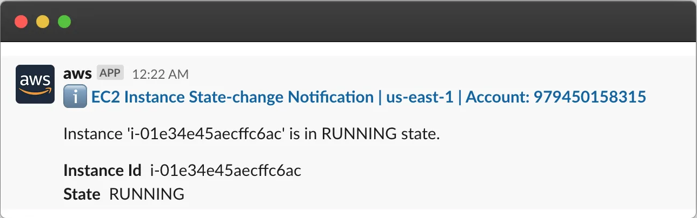

### Terminating the EC2 instance

- Let's terminate the above-created instance to check the `EC2 Termination` Slack notification.

```bash
# Terminate the ec2 instance
aws ec2 terminate-instances \
--instance-ids $AWS_EC2_INSTANCE_ID
```

- Verify the Slack notification.

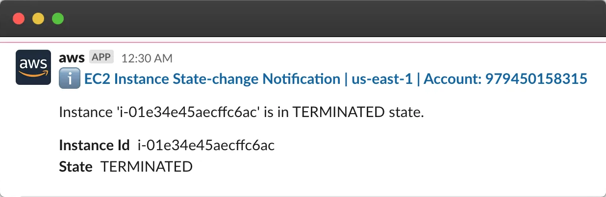

## What's next?

Today you have added AWS Chatbot Basics, along with two practical use-cases to your AWS knowledge arsenal.

> Let's meet in the next part of this AWS ChatOps series to see a very exciting use-case, i.e. Executing AWS CLI commands directly from the Slack channel.

To refer to the official documentation for Chatbot, you can visit [here](https://docs.aws.amazon.com/Chatbot/latest/adminguide/what-is.html).
