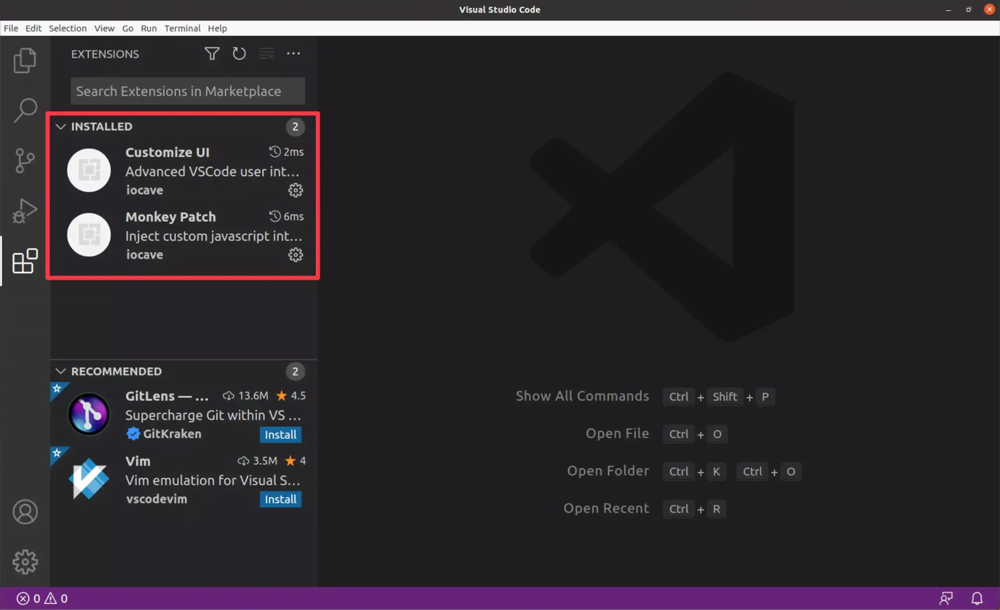
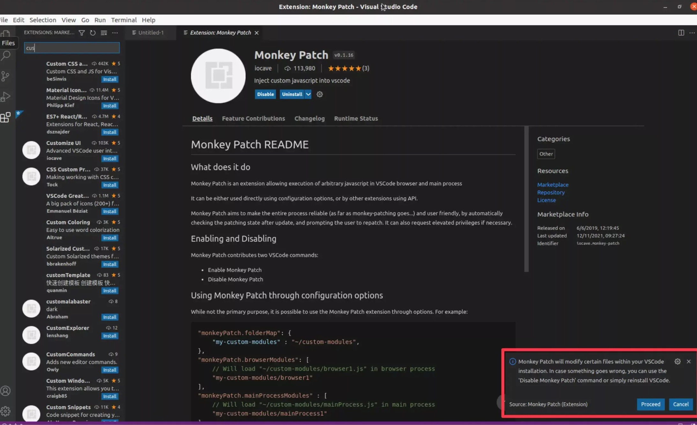
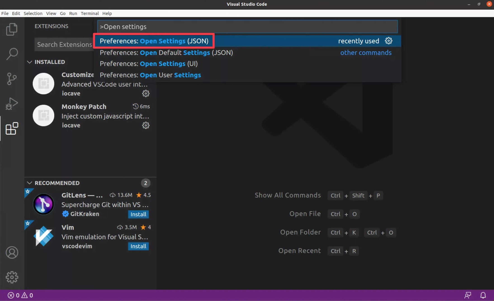
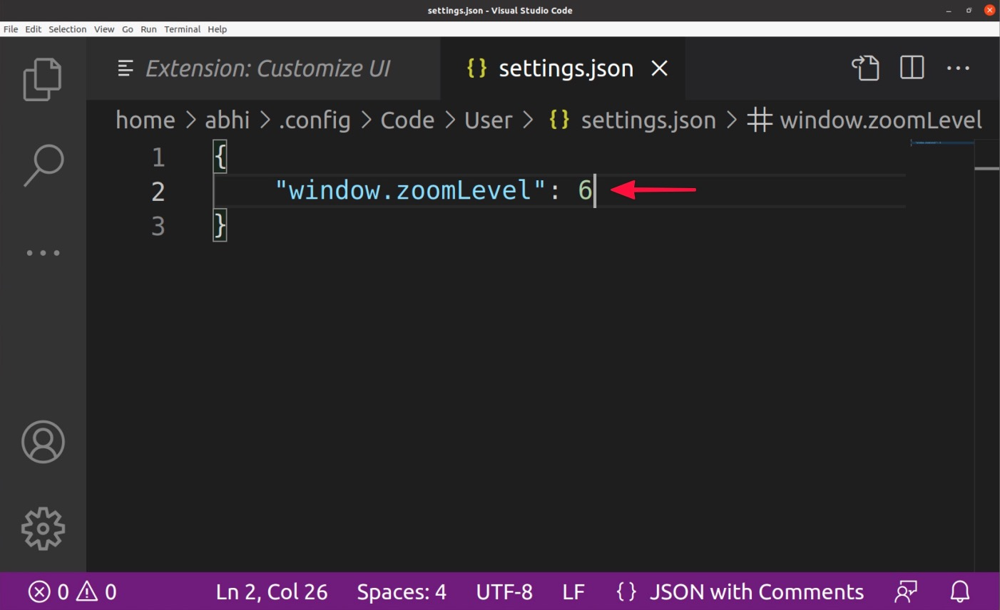
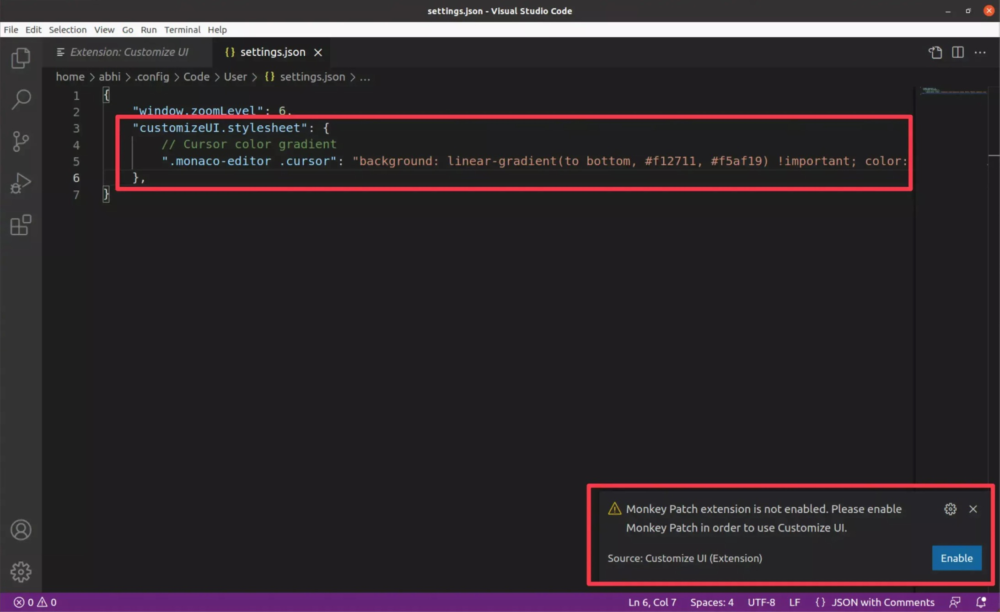
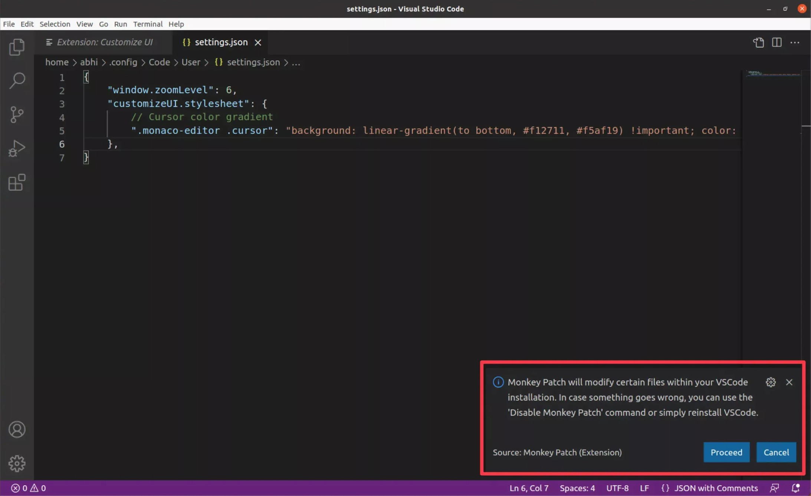
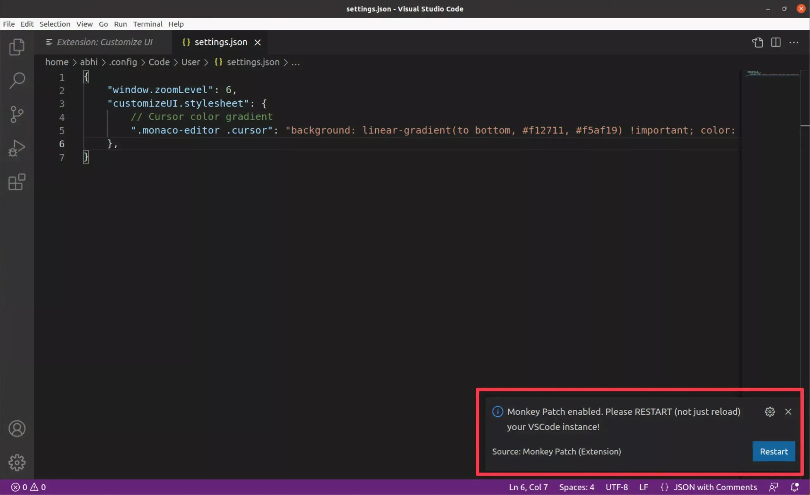
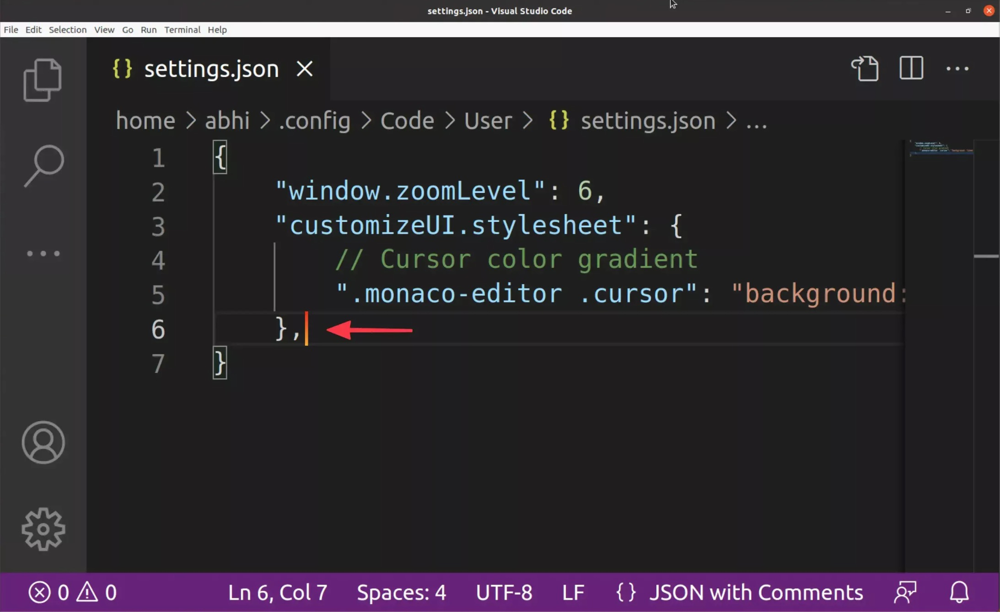
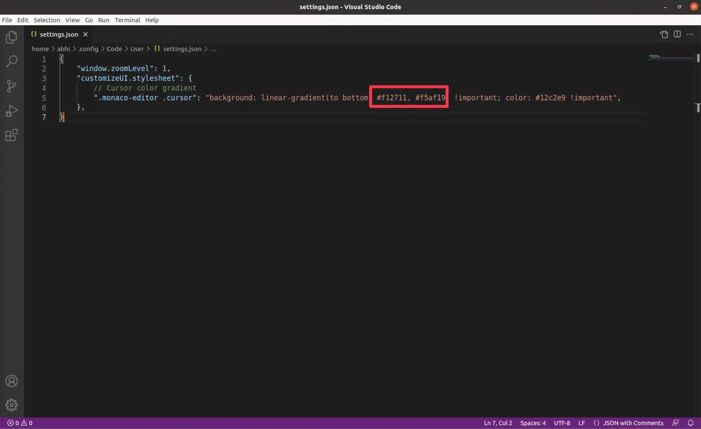

## Familiar with VSCode
So, you know about [VSCode](https://code.visualstudio.com/). It's an excellent tool, no doubt. It redefines code editing (Microsoft's words, not mine).

Along with some nifty code editing features, it offers endless options for customizations and tweaks to make it yours.

You might be familiar with these options and using some of these to customize your VSCode. ***Themes, Fonts, Integrations, Workflows, Shortcuts, and Extensions***.

But, if you dig just a little under-hood of VSCode, you will know that VSCode comprises [Electron framework](https://www.electronjs.org/). That means it's a Chrome-like browser running various HTML and CSS scripts.

And that is what makes VSCode a power tool when it comes to customizations.

## What's in this series?
In this series, we will take a deep dive into VSCode's under-hood and tweak it from the inside out. We will be using various Themes, Extensions, Fonts, Shortcuts, and Workflow that will make you a **true Pro** in VSCode.

## Kick off
Let's start with simple customization that you probably haven't considered possible yet.

> Let's change the color of the Cursor in VSCode. Yeah! You know what, let's take it to the next level already. Let's not only change the color of the Cursor but let's make it a color gradient.

### Required Extensions
Below are the two extensions we will constantly use in this series.

| Extension | Summary |
| :-----: | :-----: |
| [Customize UI](https://marketplace.visualstudio.com/items?itemName=iocave.customize-ui)     | Advanced VSCode user interface customizations.     |
| [Monkey Patch](https://marketplace.visualstudio.com/items?itemName=iocave.monkey-patch) | Inject custom javascript into vscode |

> You need to install `Customize UI` as it will also install the `Monkey Patch` extension. After installing these extensions, you will see a few notifications popping up for accepting the installation.





### Let's change the color of the Cursor

- Press <kbd>Ctrl</kbd> / <kbd>cmd</kbd> + <kbd>Shift</kbd> + <kbd>p</kbd> to open up global functions menu in VSCode.
- Type `Open settings`, and select `Preferences: Open Settings (JSON)`.



- It will open the `JSON Settings` for the VSCode. Again, we will be using this settings page frequently while going forward in series.
- Notice the default color of the cursor.



- Paste the below `JSON` code block to update the color gradient of the cursor.
```json
"customizeUI.stylesheet": {
      // Cursor color gradient
      ".monaco-editor .cursor": "background: linear-gradient(to bottom, #f12711, #f5af19) !important; color: #12c2e9 !important",
  },
```
- Once you save the `Settings`, `Monkey Patch` will ask you to `Enable`, `Proceed` and `Restart` the VSCode.







- After restarting VSCode, you should see a change in the cursor color.



### More Color Gradients
- Here are some of the color gradients that I use regularly.
```JSON
".monaco-editor .cursor": "background: linear-gradient(to bottom, #43cea2, #185a9d) !important; color: #12c2e9 !important",
```
```JSON
".monaco-editor .cursor": "background: linear-gradient(to bottom, #ee0979, #ff6a00) !important; color: #12c2e9 !important",
```
```JSON
".monaco-editor .cursor": "background: linear-gradient(to bottom, #00c3ff, #ffff1c) !important; color: #12c2e9 !important",
```
- In the code block, you have to change below two values to update your color gradient.



- You can also use this site to find various gradients.
https://uigradients.com/

## What's next?
Let's continue to explore VSCode in this series. I will keep each post short and to the point. Until then, try out this customization and let me know what you think.
