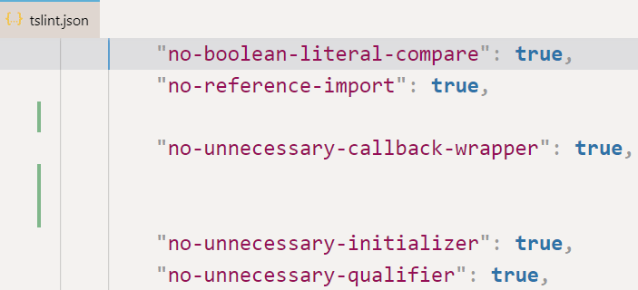
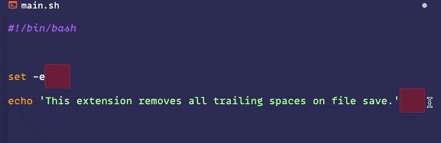
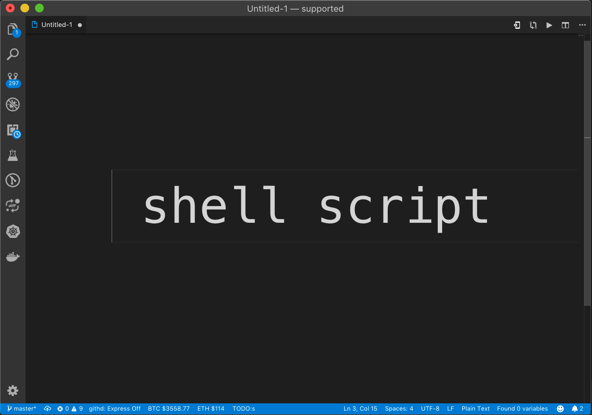
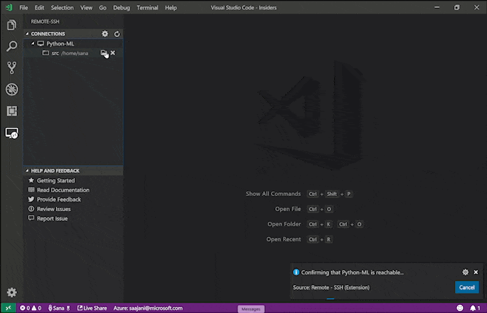
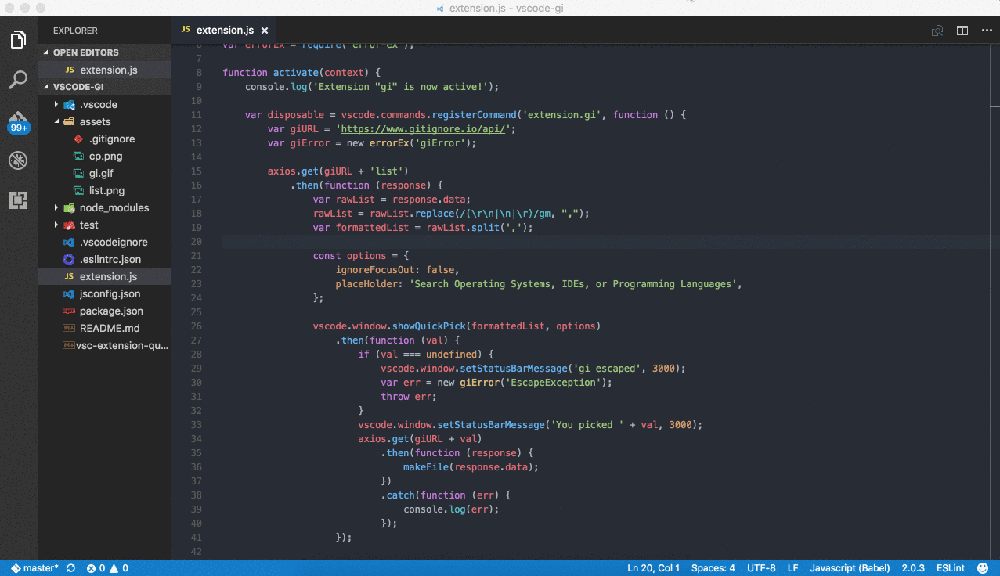

DevOps engineers are the ones who wear many hats and juggle multiple tasks at once. They need to be productive and efficient but quick on their feet and able to adapt to change. To be effective and efficient, they need the right tools. Here are 7 VSCode extensions for DevOps engineers to help get done your DevOps tasks faster and more efficiently. So without further ado, let's get started!

## VSCode extensions for DevOps engineers

| Extension | Summary |
|:-----:|:-----:|
| Path Autocomplete | Provides path completion for visual studio code. |
| Remove empty lines | Removes empty lines in the selection or entire document |
| Trailing Spaces | Highlight trailing spaces and delete them in a click! |
| shell-format | Neatly format your shell scripts, Dockerfiles, .gitignore files |
| Remote - SSH | Edit files on remote servers with VSCode |
| change-case | Quickly change the case (camelCase, CONSTANT*CASE, snake*case, etc) of the current selection or current word |
| gi | Generating .gitignore files made easy |

### Path Autocomplete

[Path Autocomplete](https://marketplace.visualstudio.com/items?itemName=ionutvmi.path-autocomplete) extension can benefit you if you work on a project with many files. It gives you suggestions for paths as you type, which can save you a lot of time when you want to refer to a file in, let\'s say, a shell script. This extension adds autocomplete functionality for filenames and paths across all workspace folders.

### Remove empty lines

As a DevOps engineer, you often need to work with configuration files. And one of the things you might want to do is remove all empty lines from a file. The [Remove Empty Lines](https://marketplace.visualstudio.com/items?itemName=usernamehw.remove-empty-lines) extension can help you with that. It removes all blank lines from the current document or the selection if there is one.

### Trailing Spaces

Another thing you might want to do when working with configuration files is remove trailing spaces. The [Trailing Spaces](https://marketplace.visualstudio.com/items?itemName=shardulm94.trailing-spaces) extension can help you with that. It highlights trailing spaces in red and lets you delete them with a simple keystroke.

### shell-format

If you\'re working on a shell script, the [shell-format](https://marketplace.visualstudio.com/items?itemName=foxundermoon.shell-format) extension can help you format it correctly. It formats your code according to the POSIX standard and can even help fix some common shell script errors.

### Remote - SSH

The [Remote - SSH](https://marketplace.visualstudio.com/items?itemName=ms-vscode-remote.remote-ssh) extension is helpful if you need to connect to a remote server via SSH. It allows you to open a folder on a remote server and work with it as if it were a local folder. You can edit files directly on the server, and the changes will be synced back to your local machine.

### change-case

The [change-case](https://marketplace.visualstudio.com/items?itemName=wmaurer.change-case) extension can be beneficial when working with text files. It allows you to quickly convert the case of selected text or the whole document. You can convert to lowercase, uppercase, CamelCase, snake*case, and more.*

### gi

Last but not least, the [gi](https://marketplace.visualstudio.com/items?itemName=rubbersheep.gi) extension is beneficial when working with Git projects. It allows you to quickly generate a `.gitignore` file based on the project\'s code base. For example, you can create a `.gitignore` file for your Terraform code in just a few clicks instead of searching the internet.

## Conclusion

These are just some of the VSCode extensions that can help improve your productivity and efficiency as a DevOps engineer. So if you haven\'t already, be sure to check them out! And if you have any other suggestions, feel free to share them in the comments below.
